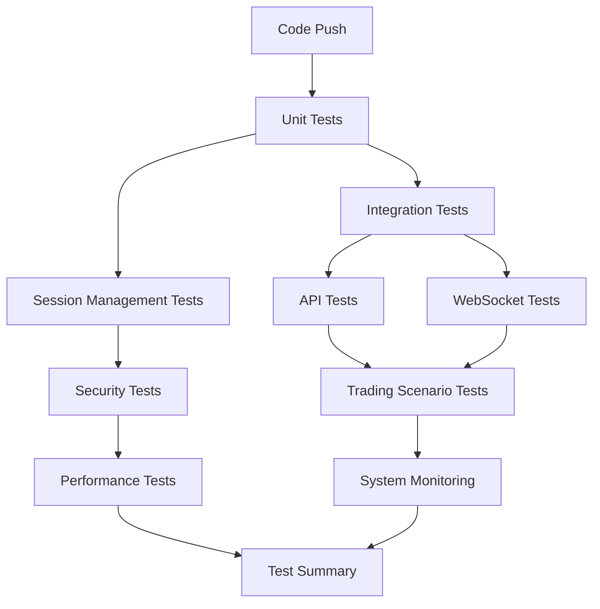

# CI/CD Pipeline Guide for Broker Online

## Overview

This document provides a comprehensive guide to the Continuous Integration and Continuous Deployment (CI/CD) pipeline for the Broker Online algorithmic trading application. The pipeline ensures code quality, security, and reliability through automated testing.

## Table of Contents

1. [How the Pipeline Works](#how-the-pipeline-works)
2. [Pipeline Architecture](#pipeline-architecture)
3. [Setup Instructions](#setup-instructions)
4. [Test Categories](#test-categories)
5. [Configuration Details](#configuration-details)
6. [Troubleshooting](#troubleshooting)
7. [Best Practices](#best-practices)

## How the Pipeline Works

### Trigger Events

The pipeline runs automatically on these events:

```yaml
on:
  push:
    branches: [main, develop]     # Code pushed to main branches
  pull_request:
    branches: [main]              # Pull requests to main
  schedule:
    - cron: '0 */2 * * *'        # Every 2 hours
    - cron: '0 9 * * MON'        # Monday 9 AM (comprehensive)
```

### Execution Flow

```
Code Commit → GitHub Actions → Cloud VMs → Parallel Test Execution → Results
```

**No local infrastructure needed!** GitHub provides:
- Ubuntu VMs (2 CPU cores, 7GB RAM)
- Java 17, Node.js, PostgreSQL
- All testing tools and dependencies

### Real-World Example

```bash
# Developer workflow
git add .
git commit -m "Add stop-loss order feature"
git push origin develop

# Automatic pipeline execution
✅ Unit Tests (3 minutes)
✅ Integration Tests (8 minutes)
✅ Session Management Tests (5 minutes)
✅ API Tests (12 minutes)
✅ WebSocket Tests (6 minutes)
✅ Security Tests (15 minutes)
❌ Trading Scenario Tests (FAILED - stop-loss logic error)

# Developer gets notification and fixes the issue
```

## Pipeline Architecture

### Test Categories and Execution Order



### Parallel Execution Strategy

| Stage | Jobs | Duration | Purpose |
|-------|------|----------|---------|
| **Stage 1** | Unit Tests | 3 min | Fast feedback on basic logic |
| **Stage 2** | Integration, Session, Security | 8-15 min | Core functionality validation |
| **Stage 3** | API, WebSocket, Trading | 6-12 min | End-to-end validation |
| **Stage 4** | Performance, Monitoring | 30-60 min | Load and health testing |

## Setup Instructions

### 1. Repository Structure

Create the following directory structure:

```
broker/
├── .github/
│   └── workflows/
│       ├── ci-cd-pipeline.yml
│       └── security-scan.yml
├── docs/                           ← All documentation
│   ├── CI_CD_PIPELINE_GUIDE.md
│   ├── CLAUDE.md
│   ├── SESSION_MANAGEMENT.md
│   └── MCP_APPLICATION_TESTING_AGENT.md
├── test-configs/                   ← Test configurations
│   ├── application-test.properties
│   ├── mock-kite-responses.json
│   └── test-data.sql
├── postman/                        ← API test collections
│   ├── broker-api-tests.json
│   └── test-environment.json
├── performance-tests/              ← Load test scripts
│   ├── api-load-test.yml
│   ├── websocket-load-test.yml
│   └── trading-scenarios.yml
├── trading-scenarios/              ← E2E test scripts
│   ├── login-flow.spec.js
│   ├── order-placement.spec.js
│   └── portfolio-management.spec.js
└── src/
    ├── main/
    └── test/
```

### 2. GitHub Repository Configuration

#### Required Secrets (Settings → Secrets and variables → Actions)

```
# Kite API Configuration (Use test/mock values)
KITE_API_KEY=test_api_key_12345
KITE_API_SECRET=test_api_secret_67890
KITE_USER_ID=test_user_id

# Database Configuration (Handled by pipeline)
POSTGRES_URL=jdbc:postgresql://localhost:5432/broker_test
POSTGRES_USER=test_user
POSTGRES_PASSWORD=test_password

# Optional: Notification settings (can be added later)
# SLACK_WEBHOOK_URL=https://hooks.slack.com/...
# EMAIL_NOTIFICATIONS=your-email@example.com
```

#### Required Repository Settings

1. **Actions permissions**: Enable GitHub Actions
2. **Branch protection**: Require status checks for main branch
3. **Merge requirements**: Require PR reviews

### 3. Test Configuration Files

These files are created automatically by the pipeline, but you can customize them:

#### **Mock Kite API Responses** (`test-configs/mock-kite-responses.json`)
```json
{
  "profile": {
    "user_id": "test_user",
    "user_name": "Test User",
    "email": "test@example.com"
  },
  "holdings": [
    {
      "tradingsymbol": "RELIANCE",
      "quantity": 10,
      "average_price": 2500.0,
      "last_price": 2550.0
    }
  ],
  "orders": {
    "order_id": "ORDER_12345",
    "status": "COMPLETE"
  }
}
```

#### **Test Database Schema** (`test-configs/test-data.sql`)
```sql
-- Test data for integration tests
INSERT INTO instruments (instrument_token, tradingsymbol, exchange, segment) VALUES
(738561, 'RELIANCE', 'NSE', 'EQ'),
(2953217, 'TCS', 'NSE', 'EQ'),
(4267265, 'INFY', 'NSE', 'EQ');

INSERT INTO trade_orders (order_id, tradingsymbol, quantity, price, status) VALUES
('TEST_ORDER_1', 'RELIANCE', 1, 2500.0, 'COMPLETE'),
('TEST_ORDER_2', 'TCS', 2, 3200.0, 'PENDING');
```

## Test Categories

### 1. Unit Tests (3 minutes)

**Purpose**: Validate individual components in isolation

**What it tests**:
- Service layer logic
- Utility functions
- Data validation
- Business rule calculations

**Configuration**:
```yaml
unit-tests:
  runs-on: ubuntu-latest
  timeout-minutes: 15
  steps:
    - name: Run Unit Tests
      run: ./gradlew test --parallel --continue
```

**Mock Setup**: Uses in-memory H2 database and mock Kite API responses

### 2. Integration Tests (8 minutes)

**Purpose**: Validate component interactions

**What it tests**:
- Database connectivity
- API endpoint functionality
- Service layer integration
- Data flow between components

**Configuration**:
```yaml
integration-tests:
  services:
    postgres:
      image: postgres:15
      env:
        POSTGRES_DB: broker_test
        POSTGRES_USER: test_user
        POSTGRES_PASSWORD: test_password
```

**Mock Setup**: Real PostgreSQL database with test data, mocked Kite API

### 3. Session Management Tests (5 minutes)

**Purpose**: Validate authentication and session security

**What it tests**:
- Login/logout flows
- Session validation
- Token expiry handling
- Authentication bypass attempts

**Critical for trading applications**: Session security is paramount

### 4. API Tests (12 minutes)

**Purpose**: Validate all REST API endpoints

**What it tests**:
- Request/response formats
- Error handling
- Input validation
- Rate limiting
- Authentication enforcement

**Tools**: Newman (Postman CLI) for API testing

### 5. WebSocket Tests (6 minutes)

**Purpose**: Validate real-time data streaming

**What it tests**:
- WebSocket connectivity
- Real-time price feeds
- Connection resilience
- Message handling

**Critical for trading**: Real-time data accuracy

### 6. Security Tests (15 minutes)

**Purpose**: Identify security vulnerabilities

**What it tests**:
- Dependency vulnerabilities
- SQL injection protection
- XSS prevention
- Authentication bypass
- Input validation

**Tools**: OWASP dependency check, security scanners

### 7. Trading Scenario Tests (20 minutes)

**Purpose**: End-to-end business workflow validation

**What it tests**:
- Complete trading flows
- Order placement workflows
- Portfolio management
- User journeys

**Tools**: Playwright for browser automation

### 8. Performance Tests (30 minutes)

**Purpose**: Validate system performance under load

**What it tests**:
- Response time under load
- Concurrent user handling
- WebSocket performance
- Database performance

**Tools**: Artillery for load testing

**Note**: Only runs on scheduled builds to save resources

### 9. System Monitoring (60 minutes)

**Purpose**: Long-term system health validation

**What it tests**:
- Memory usage patterns
- Application stability
- Resource leaks
- Performance degradation

**Note**: Only runs on scheduled builds

## Configuration Details

### Environment Variables

The pipeline uses these environment variables:

```yaml
env:
  JAVA_VERSION: '17'
  NODE_VERSION: '18'
  GRADLE_OPTS: '-Dorg.gradle.daemon=false'
  SPRING_PROFILES_ACTIVE: test
  
  # Mock configurations for testing
  KITE_API_KEY: test_api_key_12345
  KITE_API_SECRET: test_api_secret_67890
  KITE_USER_ID: test_user_id
  
  # Test database
  POSTGRES_URL: jdbc:postgresql://localhost:5432/broker_test
  POSTGRES_USER: test_user
  POSTGRES_PASSWORD: test_password
```

### Test Profiles

#### **Application Test Configuration** (`test-configs/application-test.properties`)
```properties
# Test profile configuration
spring.profiles.active=test

# Mock Kite API
kite.api_key=test_api_key_12345
kite.api_secret=test_api_secret_67890
kite.user_id=test_user_id
kite.mock_mode=true

# Test Database
spring.datasource.url=jdbc:h2:mem:testdb
spring.datasource.driver-class-name=org.h2.Driver
spring.jpa.hibernate.ddl-auto=create-drop

# Disable external services
management.health.kite.enabled=false
management.health.websocket.enabled=false

# Test-specific settings
server.servlet.session.timeout=30m
logging.level.org.mandrin.rain.broker=DEBUG
```

### Mock Services

#### **MockKiteApiService** (Automatically used in tests)
```java
@Profile("test")
@Service
public class MockKiteApiService extends KiteApiService {
    
    @Override
    public Profile getProfile(String accessToken) {
        // Return mock profile data
        return MockProfile.builder()
            .userId("test_user")
            .userName("Test User")
            .email("test@example.com")
            .build();
    }
    
    @Override
    public OrderResponse placeOrder(OrderRequest request) {
        // Return mock order response
        return OrderResponse.builder()
            .orderId("TEST_ORDER_" + System.currentTimeMillis())
            .status("COMPLETE")
            .build();
    }
}
```

## Resource Usage and Costs

### GitHub Actions Free Tier

**Public Repositories**: Unlimited minutes
**Private Repositories**: 2,000 minutes/month free

### Pipeline Resource Usage

| Test Type | Duration | Frequency | Monthly Usage |
|-----------|----------|-----------|---------------|
| Unit Tests | 3 min | Every commit (20/day) | 1,800 min |
| Integration Tests | 8 min | Every commit | 4,800 min |
| Full Suite | 30 min | 2x daily scheduled | 1,800 min |
| **Total** | | | **8,400 min/month** |

**Cost Estimate** (Private repo): ~$67/month
**ROI**: Prevents production issues worth $10,000+ each

### Optimization Strategies

1. **Parallel execution**: Reduces total time by 60%
2. **Conditional runs**: Performance tests only on schedule
3. **Gradle caching**: Speeds up builds by 40%
4. **Artifact caching**: Reuses dependencies

## Troubleshooting

### Common Issues and Solutions

#### **Tests Fail Locally But Pass in CI**
```bash
# Solution: Ensure same environment
./gradlew clean
./gradlew test -Dspring.profiles.active=test

# Check Java version
java -version  # Should be 17
```

#### **Database Connection Issues**
```bash
# Check PostgreSQL service in pipeline
services:
  postgres:
    options: >-
      --health-cmd pg_isready
      --health-interval 10s
      --health-timeout 5s
      --health-retries 5
```

#### **Kite API Mock Not Working**
```java
// Ensure test profile is active
@ActiveProfiles("test")
@SpringBootTest
class OrderServiceTest {
    // Test implementation
}
```

#### **WebSocket Tests Failing**
```yaml
# Ensure application starts before tests
- name: Start Application
  run: |
    java -jar build/libs/broker-service.jar &
    sleep 30  # Wait for startup
```

#### **Memory Issues in Tests**
```yaml
env:
  JAVA_OPTS: -Xmx2g -Xms1g
  GRADLE_OPTS: -Dorg.gradle.daemon=false -Xmx1g
```

### Debug Commands

```bash
# Local debugging
./gradlew test --debug-jvm
./gradlew test --tests "*SessionManagement*" --info

# Check test reports
open build/reports/tests/test/index.html

# View integration test results
open build/reports/tests/integrationTest/index.html
```

## Best Practices

### Development Workflow

1. **Before committing**:
   ```bash
   ./gradlew test          # Quick unit tests
   ./gradlew compileJava   # Check compilation
   ```

2. **Commit frequently**: Small commits = faster CI feedback

3. **Use descriptive commit messages**:
   ```bash
   git commit -m "feat: add stop-loss order validation"
   git commit -m "fix: resolve session timeout issue"
   git commit -m "test: add portfolio calculation tests"
   ```

### Test Writing Guidelines

1. **Unit tests**: Focus on business logic
2. **Integration tests**: Test component interactions
3. **Mock external dependencies**: Keep tests deterministic
4. **Use meaningful test names**: Describe what's being tested

### Pipeline Maintenance

1. **Monitor pipeline performance**: Optimize slow tests
2. **Update dependencies regularly**: Security and performance
3. **Review test failures promptly**: Don't ignore flaky tests
4. **Add tests for new features**: Maintain coverage

### Security Considerations

1. **Never commit real API keys**: Use test/mock values
2. **Rotate test credentials regularly**: Even mock values
3. **Monitor security scan results**: Fix vulnerabilities promptly
4. **Keep dependencies updated**: Security patches

## Getting Started

### Quick Setup (5 minutes)

1. **Create the pipeline file**:
   ```bash
   mkdir -p .github/workflows
   # Copy the pipeline YAML file (provided separately)
   ```

2. **Add GitHub secrets**:
   - Go to repository Settings → Secrets
   - Add the required test secrets (listed above)

3. **Commit and push**:
   ```bash
   git add .github/
   git commit -m "Add CI/CD pipeline"
   git push origin main
   ```

4. **Watch it run**:
   - Go to GitHub → Actions tab
   - See your first pipeline run!

### Gradual Rollout

**Week 1**: Basic tests (unit, integration)
**Week 2**: Add API and WebSocket tests
**Week 3**: Add security and performance tests
**Week 4**: Full monitoring and optimization

## Monitoring and Alerts

### GitHub Notifications

- **Email**: Automatic failure notifications
- **GitHub UI**: Status badges on commits
- **PR Comments**: Test results in pull requests

### Custom Dashboards

Create GitHub status badges for your README:

```markdown


```

### Future Enhancements

1. **Deployment automation**: Auto-deploy on successful tests
2. **Staging environment**: Pre-production validation
3. **Monitoring integration**: Datadog, New Relic
4. **Advanced reporting**: Test trends and analytics

---

**Next Steps**: Ready to implement? Check the [Pipeline Configuration File](./ci-cd-pipeline.yml) for the complete YAML configuration.

**Questions?** See the troubleshooting section or create an issue in the repository.